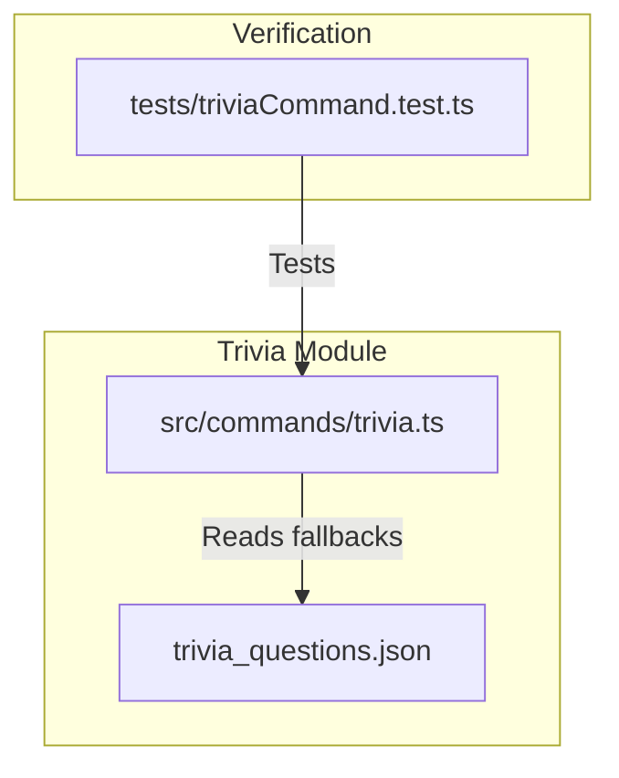

# Trivia Category Updates Implementation Plan

> **For agentic workers:** REQUIRED SUB-SKILL: Use superpowers:subagent-driven-development to implement this plan task-by-task. Steps use checkbox (`- [ ]`) syntax for tracking.

**Goal:** Modify the trivia command to remove the "History" category, refocus "Geography" on capital city names, and add a new "Basic Mathematics" category with easy math questions.

**Architecture:** We will modify the AI generation system prompt (`TRIVIA_SYSTEM_INSTRUCTION`) in the main trivia command module and align the local fallback database (`trivia_questions.json`) to match these category and theme changes. We will then verify the changes using mock-environment unit tests.

**Architecture Diagram:**



**Tech Stack:** TypeScript, Node.js (node:test runner), Discord.js

---

### Task 1: Modify AI Instructions in `src/commands/trivia.ts`

**Files:**
- Modify: `src/commands/trivia.ts`

- [ ] **Step 1: Edit the System Instructions prompt**

  Modify [trivia.ts](file:///Users/aldi/Documents/Dev/hikari-discord/src/commands/trivia.ts) using `replace_file_content` to change the `TRIVIA_SYSTEM_INSTRUCTION` core themes definition.
  
  ```diff
  -  '- Geography: National & international capitals, famous landmarks, natural wonders, province facts.',
  -  '- History: Indonesian national heroes, ancient kingdoms (Majapahit, Sriwijaya, etc.), crucial world war events.',
  -  '- Culture: Traditional fabrics (Batik/Ulos), regional houses, indigenous musical instruments, dances.',
  -  '- Basic Science & Space: Famous inventors, solar system, primary school level biology/physics/chemistry.',
  -  '- Civics & Global Agencies: ASEAN, United Nations, national state symbols, well-known acronyms.',
  +  '- Geography: National & international capital city names (e.g., capitals of countries or provinces).',
  +  '- Culture: Traditional fabrics (Batik/Ulos), regional houses, indigenous musical instruments, dances.',
  +  '- Basic Science & Space: Famous inventors, solar system, primary school level biology/physics/chemistry.',
  +  '- Civics & Global Agencies: ASEAN, United Nations, national state symbols, well-known acronyms.',
  +  '- Basic Mathematics: Simple and easy basic math questions suitable for trivia (e.g., addition, subtraction, multiplication, division of small integers, basic shapes properties).',
  ```

- [ ] **Step 2: Verify code syntax**

  Verify syntax by compiling the TypeScript project.
  Run: `npm run build`
  Expected: Command completes successfully with exit code 0.

- [ ] **Step 3: Commit code**

  Run:
  ```bash
  git add src/commands/trivia.ts
  git commit -m "feat(trivia): update AI system instruction categories (remove History, focus Geography, add Basic Math)"
  ```

---

### Task 2: Update Local Fallback Questions in `trivia_questions.json`

**Files:**
- Modify: `trivia_questions.json`

- [ ] **Step 1: Update JSON content**

  Replace [trivia_questions.json](file:///Users/aldi/Documents/Dev/hikari-discord/trivia_questions.json) to remove category `"Sejarah"`, refocus `"Geografi"` questions, and add easy `"Matematika"` questions.
  Use the complete new JSON content to overwrite/replace the file.
  
  Specific modifications:
  1. Remove ID 3 (`"Sejarah"`) and replace it with:
     ```json
     {
       "id": 3,
       "kategori": "Matematika",
       "soal": "Berapakah hasil dari 15 + 8?",
       "pilihan": ["A. 21", "B. 22", "C. 23", "D. 24"],
       "jawaban_benar": "C"
     }
     ```
  2. Modify ID 4 (`"Geografi"`) to focus on a capital city:
     ```json
     {
       "id": 4,
       "kategori": "Geografi",
       "soal": "Apa nama ibu kota dari negara Prancis?",
       "pilihan": ["A. Lyon", "B. Marseille", "C. Paris", "D. Nice"],
       "jawaban_benar": "C"
     }
     ```
  3. Remove ID 6 (`"Sejarah"`) and replace it with:
     ```json
     {
       "id": 6,
       "kategori": "Matematika",
       "soal": "Berapakah hasil dari 9 x 6?",
       "pilihan": ["A. 54", "B. 45", "C. 63", "D. 56"],
       "jawaban_benar": "A"
     }
     ```
  4. Modify ID 17 (`"Geografi"`) to focus on a capital city:
     ```json
     {
       "id": 17,
       "kategori": "Geografi",
       "soal": "Apa nama ibu kota dari negara Jepang?",
       "pilihan": ["A. Osaka", "B. Tokyo", "C. Kyoto", "D. Hiroshima"],
       "jawaban_benar": "B"
     }
     ```
  5. Remove ID 18 (`"Sejarah"`) and replace it with:
     ```json
     {
       "id": 18,
       "kategori": "Matematika",
       "soal": "Berapakah hasil dari 36 dibagi (/) 6?",
       "pilihan": ["A. 4", "B. 5", "C. 6", "D. 7"],
       "jawaban_benar": "C"
     }
     ```
  6. Modify ID 24 (`"Geografi"`) to focus on a capital city:
     ```json
     {
       "id": 24,
       "kategori": "Geografi",
       "soal": "Apa nama ibu kota dari provinsi Jawa Timur?",
       "pilihan": ["A. Surabaya", "B. Malang", "C. Semarang", "D. Bandung"],
       "jawaban_benar": "A"
     }
     ```
  7. Add a new Matematika question ID 31 at the end:
     ```json
     {
       "id": 31,
       "kategori": "Matematika",
       "soal": "Berapakah hasil dari 25 - 12?",
       "pilihan": ["A. 11", "B. 12", "C. 13", "D. 14"],
       "jawaban_benar": "C"
     }
     ```

- [ ] **Step 2: Commit JSON changes**

  Run:
  ```bash
  git add trivia_questions.json
  git commit -m "feat(trivia): update local fallback questions json"
  ```

---

### Task 3: Verify and Run Unit Tests

**Files:**
- Test: `tests/triviaCommand.test.ts`

- [ ] **Step 1: Run the test suite**

  Run:
  `GEMINI_API_KEY=mock-key OPENAI_API_KEY=mock-key GROQ_API_KEY=mock-key node --test -r ts-node/register tests/triviaCommand.test.ts`
  
  Expected output:
  All 12 tests pass successfully.

- [ ] **Step 2: Commit any test adjustments (if any)**

  Run:
  ```bash
  git commit -am "test(trivia): verify all test cases pass successfully" || true
  ```
